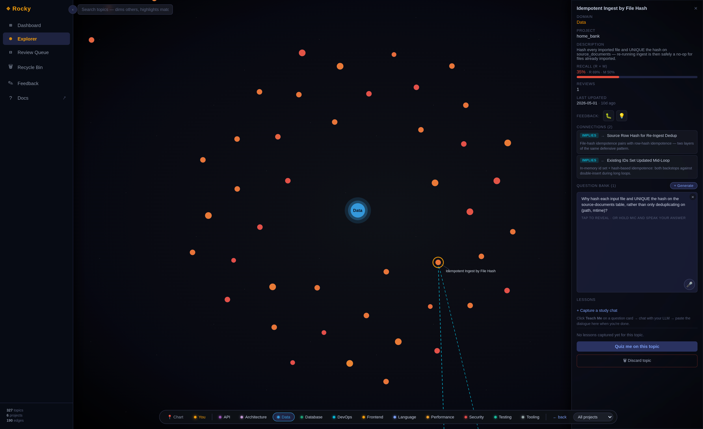
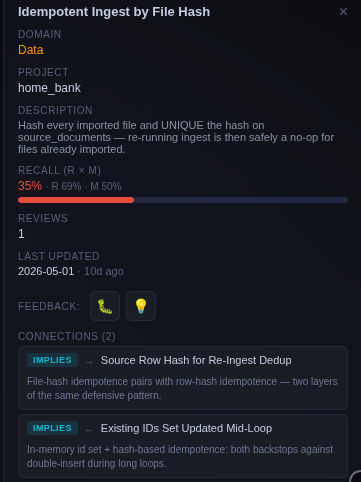
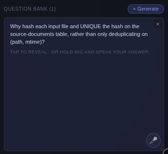
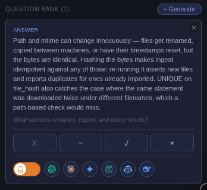
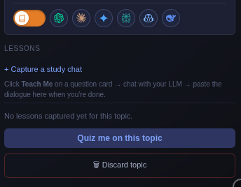

A real Rocky session, end to end — `rocky install claude-all`, work with the agent, `/rocky-checkpoint`, then open `rocky view` and watch the IQ banner climb.

```youtube
PLACEHOLDER
```

> **Video coming soon.** [Get notified when the demo lands →](https://tally.so/r/0Qo75P)

---

## What you'll see

### Dashboard

This is where you can keep track of your learning KPIs that matter:

- Rocky IQ: how well you actually understand the code your AI is shipping.
- Prompt IQ: how well you command your AI agents.
- Learning days and streak: Motivation to keep improving every day.
- Recently added topics from agent sessions.
- Topics due to be reviewed as determined by the FSRS system.
- Domain health: Your strongest and most improved domains.
- Topics that appear accross projects you are working on.


### Knowledge Explorer

Strap in. The Explorer is your ship — every node is a star you've passed through, every edge a wormhole to somewhere related. Your job is to chart what you've learned and find the dark patches you haven't.

- **Drop into a domain cluster.** Auth, Database, DevOps, Language — each domain is a constellation. Warp in and see every topic you've ever encountered there, in one view.
- **Warp between topics.** Click any star to recenter the map and instantly see its neighbourhood — the topics it implies, depends on, conflicts with, or belongs inside.
- **Read the wormholes.** Edges are colour-coded by kind (`implies`, `depends_on`, `conflicts_with`, `part_of`), so the relationship type teaches you *how* concepts hang together, not just *that* they do.
- **Spot the dark patches.** Weakest topics glow — a visual cue for where the void in your knowledge is still wide.
- **Quiz mid-flight.** Click a topic and start a focused review without leaving the map. Rocky asks. You answer.
- **Speak your answer.** Hit 🎤 and reply out loud — transcription runs locally via `whisper.cpp`. Nothing leaves your ship.
- **Cross-concept questions.** When two well-charted topics share a wormhole, Rocky asks you to connect them — the deepest test that you've actually understood the territory.
- **Bounded wormhole view.** ~28 stars on screen at a time regardless of how big your graph grows, so the map stays navigable as the cosmos expands.



#### Visit a star

Warp into any topic and Rocky opens its dossier: what the concept means, when you last reviewed it, which neighbouring topics it connects to, and a question waiting for your answer. This is where exploration turns into discovery — every visit either confirms what you knew or surfaces a gap you didn't know was there.

Take **Idempotent Ingest by File Hash** — a topic Rocky extracted from a commit in the `home_bank` project's Data domain. Recall is sitting at 35% (`R 69% × M 50%`), so it's been flagged as a gap. The dossier shows the description Rocky pulled from the diff, the connected topics it implies (*Source Row Hash for Re-Ingest Dedup*, *Existing IDs Set Updated Mid-Loop*), and when you last touched it.

<div class="topic-row">
<div>



**The dossier.** What the concept means, recall score, project, neighbouring topics, last reviewed.

</div>
<div>



**1. Question.** *"Why hash each input file and UNIQUE the hash, rather than only deduplicating on `(path, mtime)`?"* — an implication-grounded question Rocky generated at extraction time. Hold 🎤 to answer by voice.

</div>
<div>



**2. Answer.** The canonical explanation: hashing bytes survives renames, copies, and mtime resets that a path-based check would miss. Grade yourself **X / ~ / ✓ / ★** — your score feeds FSRS and updates mastery in real time.

</div>
<div>



**3. Lessons.** Want to go deeper? *Capture a study chat*: click **Teach Me**, chat with your LLM, paste the dialogue back. Rocky pins it to the topic so the conversation that taught you something resurfaces next time recall fades.

</div>
</div>

### Review Queue

When you'd rather not roam the map, the Queue brings everything to you — every topic that's slipping, across every session and every project you've ever worked in, ranked by what Rocky thinks you've forgotten most.

- One unified queue across **all** your sessions and projects — no per-repo silos.
- Ordered by `recall_now` (retrievability × mastery), weakest first.
- **Quiz top 5** is one click — the most direct path from "open the app" to "start drilling".
- Same 🎤 voice answers, same local `whisper.cpp` transcription.


