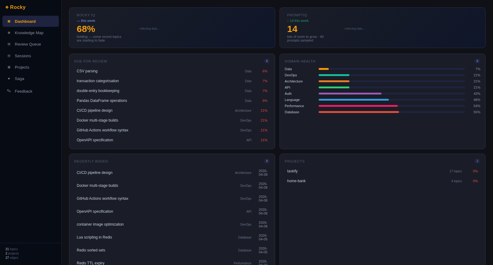
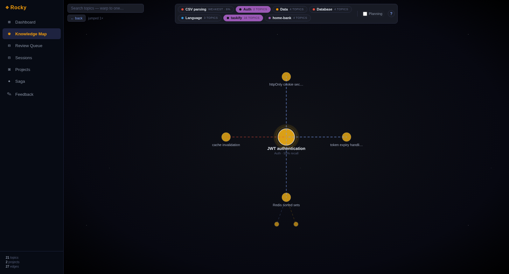
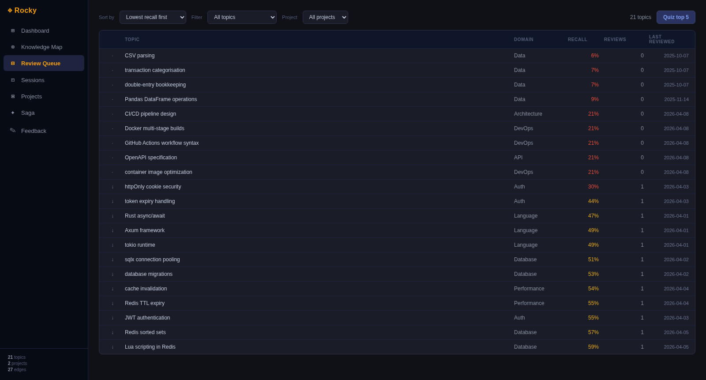
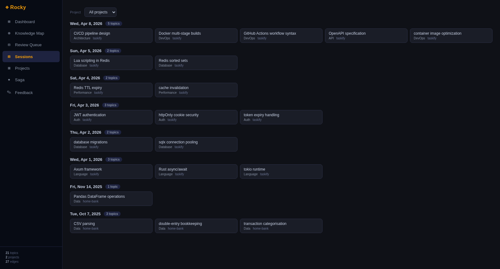
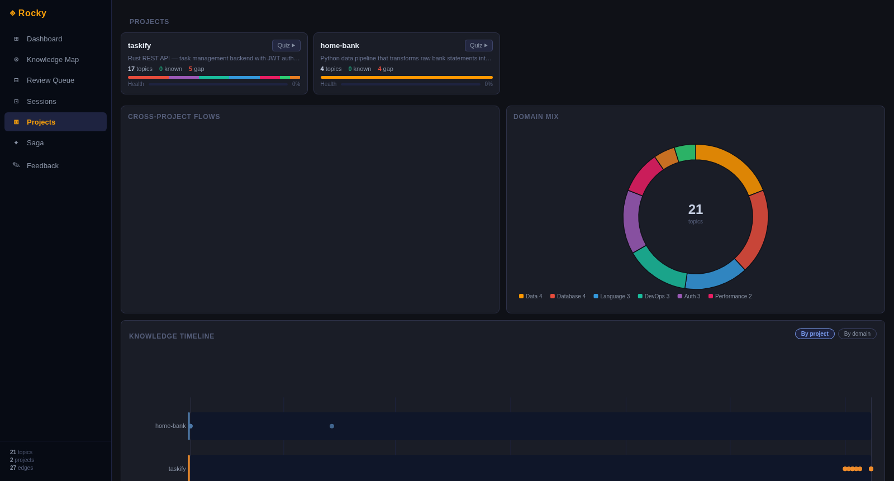

This walks you through your first session with Rocky in about 5 minutes — using the recommended Claude Code (or OpenCode) flow.

> Haven't installed yet? Start at **Installation** — `rocky install claude-all` wires up everything you need before this page makes sense.

---

## Step 1: Work normally with your AI agent

Open Claude Code in a project, work on a real task. Don't change anything about your normal flow.

Behind the scenes:

- **Each commit** silently appends its diff to `./.rocky/queue/`. No LLM call on commit — there's no interruption to your flow.
- **Each prompt** is appended to `./.rocky/prompts.jsonl`. The skills will read this transcript later to ground topic extraction in your actual session.

After a real chunk of work, you'll have a queue and a transcript ready for extraction.

---

## Step 2: End of session — extract topics

In the same Claude Code session, type:

```
/rocky-checkpoint
```

The agent reads the queued diffs + your prompt transcript, identifies the new concepts that came up, and writes them to your PKG with a four-question bank each — generic enough that the same topic resurfacing in a different project still matches.

What you get:

- **New nodes** for each distinct concept the session introduced.
- **Updated nodes** when something already in your PKG appeared again — Rocky bumps the encounter count and refreshes its weighting.
- **Cross-project dedup** — the same idea across two projects becomes one node with multiple `repos[]` entries, not two duplicates.

No LLM cost on the Rocky side here either. The agent's own context window does the extraction.

---

## Step 3: Quiz in Rocky View (recommended)

The terminal works, but the browser is where Rocky actually shines:

```bash
rocky view
```

A local server starts on `127.0.0.1:<random-port>` and your browser opens straight into the **Dashboard**. The first thing you see is your **Rocky IQ** — a single 0–100 number that summarises how well you'd recall everything in your PKG right now.

Six tabs share the same data: **Dashboard**, **Knowledge Map**, **Review Queue**, **Sessions**, **Projects**, **Saga**. Click **Quiz top 5** in the Review Queue (or **Quiz ▶** on a project card) to start a focused session on your weakest topics. Answers go in via keyboard or the 🎤 button (voice is local via `whisper.cpp`; nothing leaves the machine). The IQ banner updates live as your scores come in.

**Why the browser instead of the terminal?** The graph view turns the PKG from a flat list into something you can actually feel — clusters, gaps, and the shape of what you've learned all become visible. The answer experience is also just nicer: real text wrapping, voice input, instant graph updates, and the IQ dial right there.

### Dashboard

Rocky IQ banner with the live score and gradient bar, recent activity, and weakest topics at a glance.



### Knowledge Map

Interactive 2-hop "wormhole" graph — bounded to ~28 nodes on screen at a time regardless of PKG size. Click any node to warp focus to it. Edges are colour-coded by kind, weakest topics glow for attention.



### Review Queue

Flat list of every topic that needs attention, ranked by `recall_now` ascending. **Quiz top 5** is a single click — the most direct path from "open the app" to "start drilling."



### Sessions

What landed in your PKG day by day. Useful for "what did I learn this week?" — and for spotting weeks where nothing went in (a good sign you should check in).



### Projects

Per-project breakdown — which repos contributed which topics, with cross-project dedup made visible. **Quiz ▶** scopes a session to a single project.



The **Saga** tab is a cinematic timelapse of your knowledge graph growing over time — gated behind ~30 days of consistent reviewing as a reward, so it doesn't get a screenshot here.

---

## Step 4: Quick inline review without leaving the agent

If you'd rather not switch contexts, you can quiz directly inside Claude Code:

```
/rocky-quiz
```

The agent picks your weakest topics by `recall_now`, asks one question per topic from the canonical question bank, and writes the score back. Same FSRS state advancement as Rocky View — just text-only and inline.

This is best for *quick* reviews — a couple of questions between tasks. For a real study session, open Rocky View.

---

## What happens over time

Rocky uses FSRS — the same family of spaced-repetition algorithm Anki moved to. Topics you know well decay slowly. Topics you barely know decay fast. Over time, Rocky surfaces the right things at the right moments without spamming you.

Your **Rocky IQ** is built from `recall_now = retrievability × mastery` averaged across your PKG. It moves down when you stop engaging and up when you can answer for what you've shipped. There's no daily cap on `/rocky-checkpoint` or `rocky view` — you control when you extract and when you review.

---

:::details Alternative workflows (without an agent)
If you're not in an agent session and still want to use Rocky, the original commands still work — they just need a standalone LLM provider configured (see **Installation → Alternative workflows**).

### Pre-task quiz

```bash
rocky "add user login with JWT tokens to my Express API"
```

Rocky extracts topics from the description and quizzes you on anything new or fading — before you've touched a line of code.

### Post-commit quiz

```bash
rocky diff           # last commit
rocky diff HEAD~3    # specific commit
rocky diff --staged  # before committing
```

### On-demand terminal quiz

```bash
rocky quiz           # full review
rocky quiz "redis"   # search and pick topics
```

### Q&A options (terminal)

At any question:

- **Type your answer** and press Enter
- **Press Enter** with nothing — skip and queue for later
- **`s`** — simpler — regenerate at lower difficulty
- **`h`** — harder — regenerate with edge cases
- **`c`** — clue — short hint
- **`?`** — explain it — reveal the ideal answer (records 0.0)
- **`x`** — delete the topic (Rocky confirms first)

Rocky View has the same options as buttons in the quiz modal.

:::
