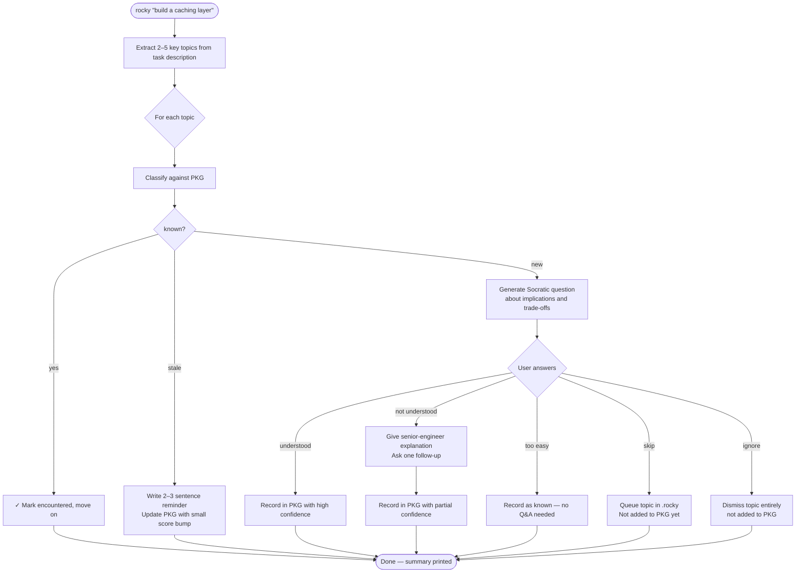
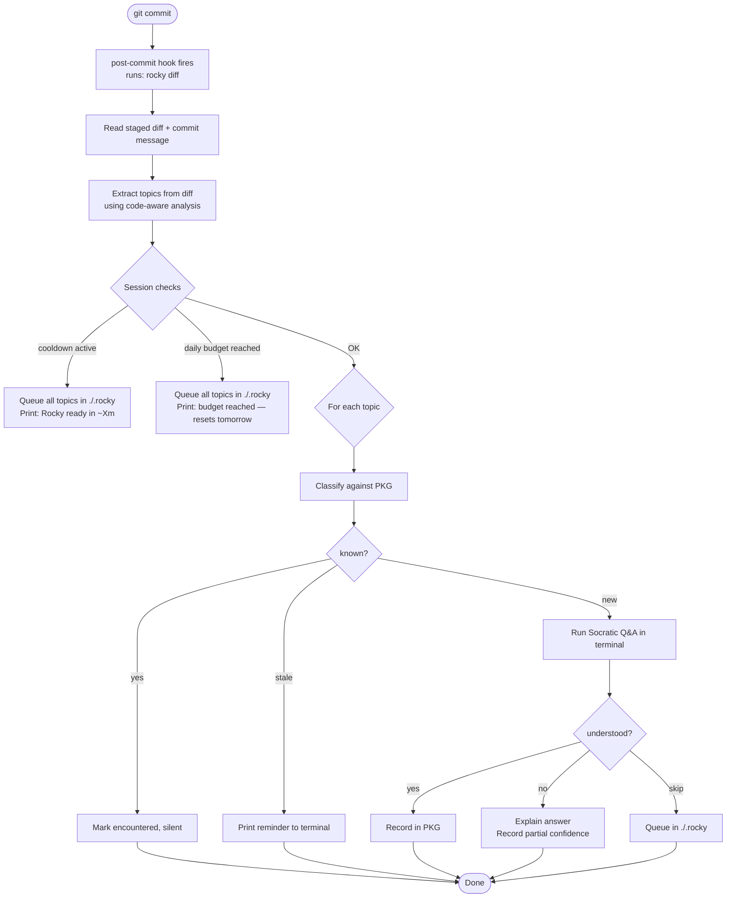
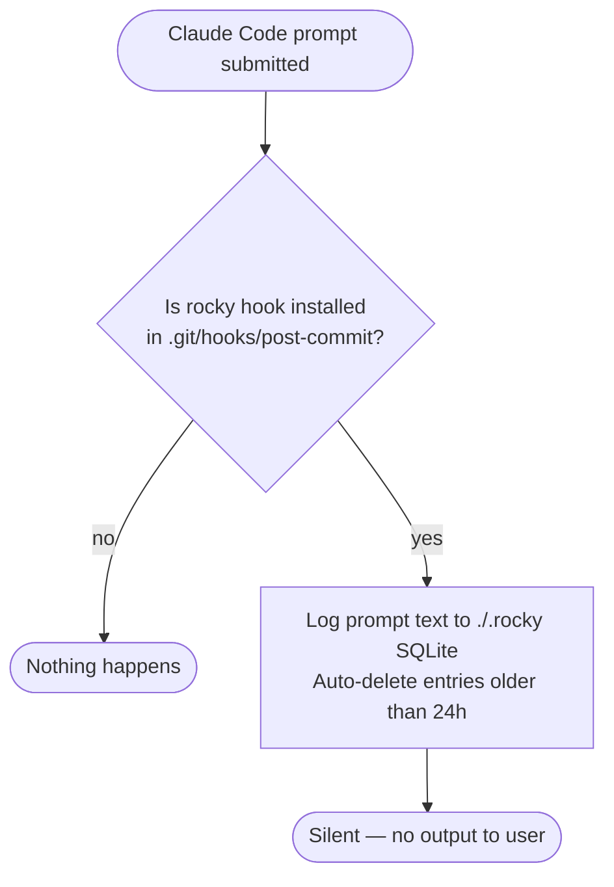
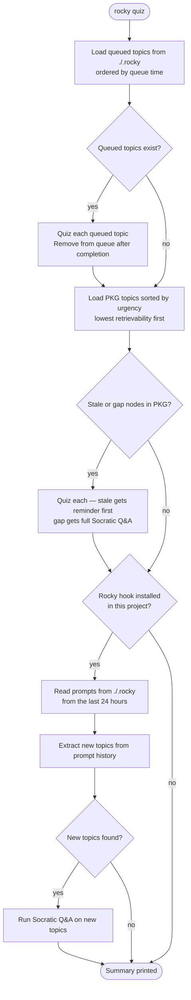
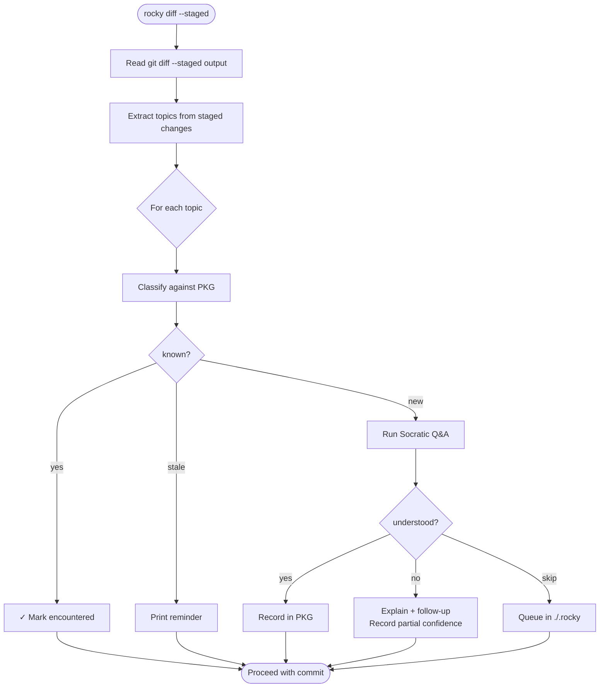
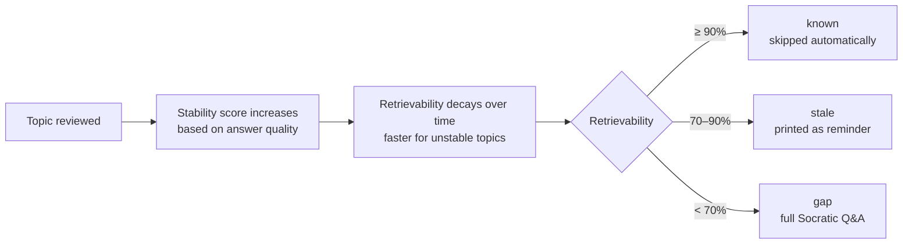

# How Rocky Works

Rocky has three modes of operation, each with different rules about when it quizzes you and what limits apply.

---

## Scenario 1: Manual task (`rocky "your task"`)

You describe what you're about to work on. Rocky extracts the topics, checks your PKG, and runs Socratic Q&A on anything new. No cooldown, no daily cap — you asked for it.

---

## Scenario 2: Git commit hook (`rocky diff`)

After every `git commit`, Rocky analyses the diff for topics that appeared in your code. Cooldown and daily budget are enforced — this is automatic, not user-initiated. Topics that can't be quizzed right now are queued in `./.rocky` for the next `rocky quiz`.

---

## Scenario 3: Claude Code hook (`rocky hook`)

When Claude Code is used in a project with Rocky configured, each prompt is silently logged to `./.rocky`. No quiz happens here — this is just capture.

---

## Scenario 4: `rocky quiz`

Explicitly request a learning session. No limits apply. Rocky works through a priority queue: queued topics first, then PKG topics most overdue for review, then anything new from recent prompts in `./.rocky`.

---

## Scenario 5: Pre-commit review (`rocky diff --staged`)

Review your staged changes before committing. Behaves like the manual flow — no limits.

---

## How the PKG classifies topics

Every topic in the PKG has a **retrievability score** — an estimate of how likely you are to recall it right now, based on how long ago you last reviewed it and how stable your knowledge is.

Higher stability means the topic decays slower — if you've demonstrated solid understanding multiple times, Rocky won't ask you about it again for weeks.

---

## Domain taxonomy

Every topic is assigned to one of 13 domains when it's first extracted. Domains group topics in the vault into subfolders and are used for Obsidian graph view clustering.

| Domain | Examples |
|---|---|
| Language | Rust lifetimes, Python decorators, Go channels |
| Database | SQL indexes, Redis TTL, Postgres transactions |
| Auth | JWT, OAuth2, RBAC, session tokens |
| API | REST design, GraphQL, WebSockets |
| Frontend | React hooks, DOM events, CSS layout |
| DevOps | Docker networking, CI/CD pipelines |
| Architecture | Event sourcing, retry patterns, microservices |
| Performance | Caching strategies, query optimisation |
| Security | OWASP, encryption, input validation |
| Testing | Unit vs integration, mocking, TDD |
| Tooling | Build systems, package managers |
| Data | Algorithms, data structures, ML concepts |
| Other | Anything that doesn't fit above |

Use `rocky classify` to assign domains to any older topics that predate this feature.
