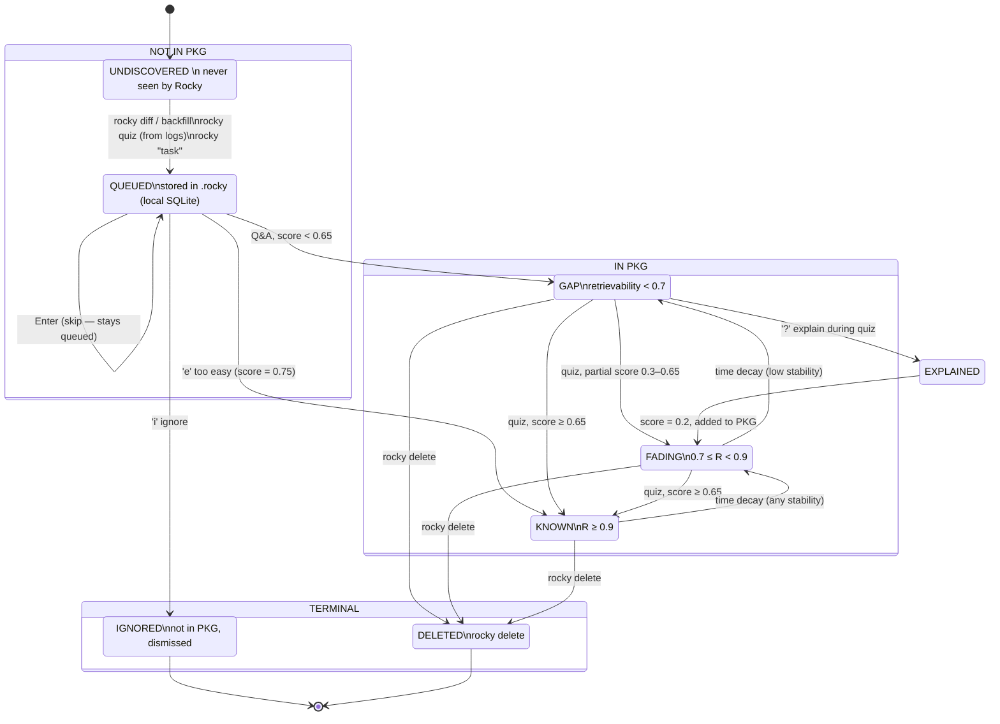

# 01 · Topic Lifecycle — State Machine

**Source files:** `src/main.rs` · `src/db.rs` · `src/fsrs.rs`



---

## State descriptions

| State | Retrievability | What Rocky does |
|---|---|---|
| UNDISCOVERED | — | Never appeared in any diff, prompt, or task |
| QUEUED | — | Seen, stored in `.rocky`, awaiting first Q&A |
| GAP | R < 0.7 | Full Socratic Q&A — cross-concept or canonical or live |
| FADING | 0.7–0.9 | 2–3 sentence reminder, small stability bump |
| KNOWN | R ≥ 0.9 | Mark encountered silently, no quiz |
| EXPLAINED | — | Transient: user typed `?`, got explanation, low confidence |
| IGNORED | — | User typed `i` — dismissed, not tracked |
| DELETED | — | `rocky delete` — removed from PKG entirely |

---

## Decay: how KNOWN becomes GAP over time

Decay is passive — no user action required. Governed by:

```
R = (1 + t / (9 × S)) ^ -1
```

- `t` = days since `last_reviewed`
- `S` = stability (increases with good answers)

A topic with `S = 2` (new) drops below the KNOWN threshold after ~2 days.
A topic with `S = 10` (reviewed several times) stays KNOWN for ~11 days.

---

## 📝 Annotation space

> Add your notes here. Questions to consider:
>
> - Are there missing states? (e.g. a `CO_AUTHORED` or `AI_ASSISTED` sub-state?)
> - Should `task_prompt` topics enter QUEUED or go straight to Q&A?
> - Should the IGNORED state be permanent, or should it expire after N days?
> - What should happen when a KNOWN topic appears in a new diff?
