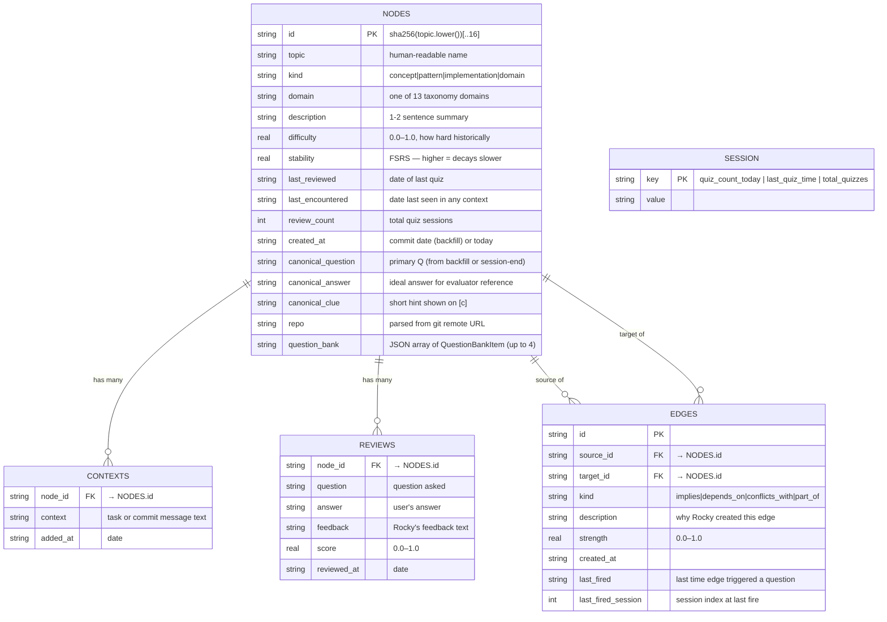

<style>
body {
    font-family: 'Roboto', sans-serif;
}
code, pre {
    font-family: 'Fira Code', 'Courier New', monospace;
}
</style>

# 02 · Data Model — Node struct + DB schema

**Source files:** `src/node.rs` · `src/db.rs` (struct `Node`, `SCHEMA` const, `row_to_node`)



---

## Computed fields (not stored in DB)

These are derived at read time from stored fields:

| Field | Formula | Where computed |
|---|---|---|
| `retrievability` | `(1 + t / (9 × stability))^-1` | `src/fsrs.rs retrieve()` |
| `classification` | `known / fading / gap` thresholds | `src/fsrs.rs classify()` |

---

## DB migrations (all idempotent)

`src/db.rs — open()` runs these on every startup. Safe to re-run.

```sql
ALTER TABLE nodes ADD COLUMN domain TEXT NOT NULL DEFAULT '';
ALTER TABLE nodes ADD COLUMN canonical_question TEXT NOT NULL DEFAULT '';
ALTER TABLE nodes ADD COLUMN canonical_answer TEXT NOT NULL DEFAULT '';
ALTER TABLE nodes ADD COLUMN canonical_clue TEXT NOT NULL DEFAULT '';
ALTER TABLE nodes ADD COLUMN repo TEXT NOT NULL DEFAULT '';
ALTER TABLE edges ADD COLUMN last_fired_session INTEGER;
```

---

## question_bank column (JSON, already shipped)

`question_bank` is a TEXT column storing a JSON array of `QuestionBankItem` objects.
Generated at `session-end` time (or manually via `rocky backfill --fill-question-bank`).
The quiz picks the least-recently-asked entry from the bank before falling back to
live generation.

```rust
// src/node.rs
pub struct QuestionBankItem {
    pub question: String,
    pub answer:   String,
    pub clue:     String,
    pub asked:    u32,   // how many times this exact question was chosen
}
```

Up to 4 items per node. When all 4 have been asked equally, asked counts are reset
(rotation restarts from the beginning).

---

## Config paths (as of feat/rich-context-enrichment)

| File | Default path | Env override |
|---|---|---|
| Config file | `~/.config/rocky/config.toml` | `XDG_CONFIG_HOME` |
| Graph DB | `~/.rocky/graph.db` | `ROCKY_HOME` |
| Models dir | `~/.rocky/models/` | `ROCKY_HOME` |
| Legacy config | `~/.rocky/.rocky.toml` | auto-migrated on first load |

---

## Planned new columns

```sql
-- proposed — not yet implemented
ALTER TABLE nodes ADD COLUMN co_authored INTEGER NOT NULL DEFAULT 0;
ALTER TABLE nodes ADD COLUMN source TEXT NOT NULL DEFAULT 'own_code';
-- source values: 'own_code' | 'ai_prompt' | 'task_prompt'

-- proposed for struggle score
ALTER TABLE reviews ADD COLUMN clue_used INTEGER NOT NULL DEFAULT 0;
ALTER TABLE reviews ADD COLUMN explain_used INTEGER NOT NULL DEFAULT 0;
ALTER TABLE reviews ADD COLUMN simpler_used INTEGER NOT NULL DEFAULT 0;
ALTER TABLE reviews ADD COLUMN followup_count INTEGER NOT NULL DEFAULT 0;
```

---

## Kind enum (`src/node.rs`)

```
concept        — abstract understanding (e.g. "cache invalidation")
pattern        — reusable design approach (e.g. "JWT authentication")
implementation — specific technique (e.g. "Redis sorted sets")
domain         — taxonomy skeleton node — never quizzed, structural only
```

---

## 📝 Annotation space

> Add your notes here. Questions to consider:
>
> - Are there fields on `Node` that are never actually used?
> - Should `source` live on the node, or be derivable from reviews + git log?
> - Should `canonical_clue` be stored separately from `canonical_answer`, or combined?
> - Is `last_encountered` distinct enough from `last_reviewed` to be worth tracking?
