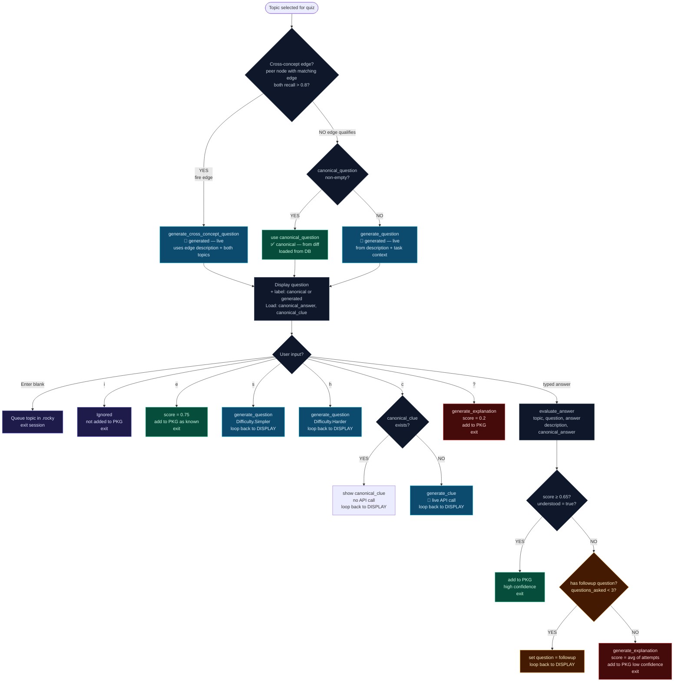

# 03 · Quiz Session — Decision Tree

**Source files:** `src/main.rs` — `run_quiz_topic()` ~line 1130

---

## Question source types

| Label shown | How generated | API call at quiz time? |
|---|---|---|
| `(canonical)` | At backfill — uses full diff + commit + README | No — read from DB |
| `(generated)` | Live — uses topic description + task context | Yes |
| Cross-concept | Live — uses edge description + both node descriptions | Yes |

---

## Scoring reference

| Action | Score passed to `add_or_update` |
|---|---|
| `e` too easy | 0.75 |
| `?` explain | 0.2 |
| Understood on first/second attempt | `eval_result.score` (0.65–1.0) |
| Exhausted (avg of attempts) | typically 0.2–0.5 |
| Stale reminder (no quiz) | 0.5 |

---

## MAX_QUESTIONS

The follow-up loop runs at most **3 times** (`MAX_QUESTIONS = 3` in `src/main.rs`).
After 3 attempts without `understood = true`, Rocky gives the full explanation.

---

## 📝 Annotation space

> Add your notes here. Questions to consider:
>
> - Where exactly should struggle score be tracked? (each loop iteration? each option used?)
> - Should `[s]` simpler reset the question counter, or count as an attempt?
> - Should clue usage affect the final score passed to `add_or_update`?
> - Should there be a `[k]` mark-as-known shortcut distinct from `[e]` too easy?
> - Is MAX_QUESTIONS = 3 right, or should it be configurable?
