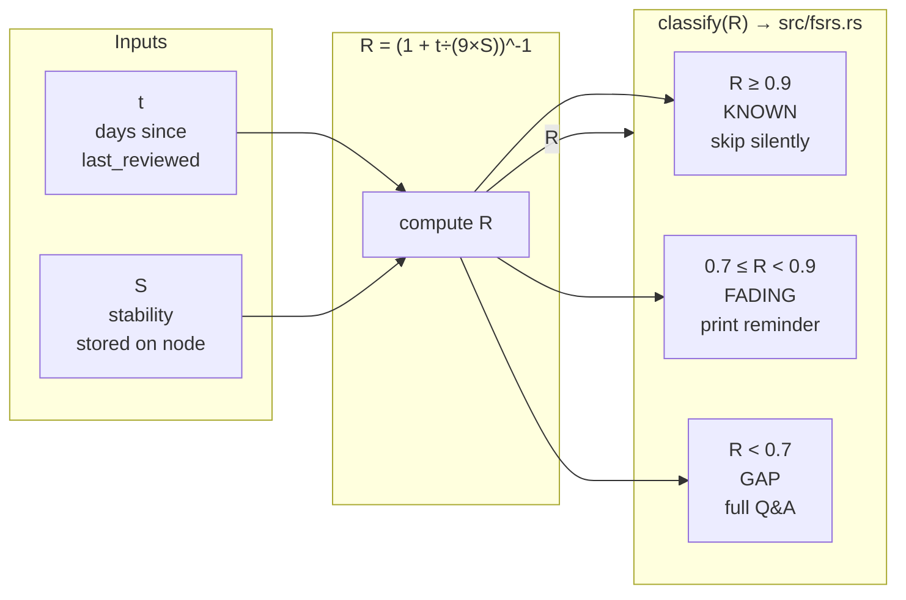
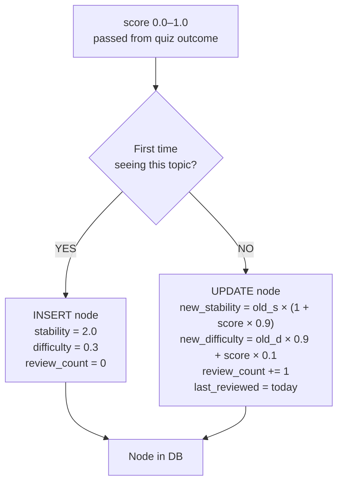

# 05 · Memory Model — FSRS (Free Spaced Repetition Scheduler)

**Source files:** `src/fsrs.rs` · `src/db.rs` — `add_or_update()`

---

## Core formula

```
R  =  ( 1  +  t / (9 × S) ) ^ -1

  R  =  retrievability  (0.0 to 1.0)
  t  =  days since last_reviewed
  S  =  stability  (stored on node, increases with good answers)
```



---

## Decay examples — days until R = 0.5

| Stability | Interpretation | Days until R = 0.5 | Days until KNOWN threshold (R=0.9) broken |
|---|---|---|---|
| S = 2.0 | New topic, first insertion | **18 days** | ~2.2 days |
| S = 5.0 | Reviewed once, decent answer | **45 days** | ~5.6 days |
| S = 10.0 | Strong repeated understanding | **90 days** | ~11 days |
| S = 20.0 | Deep, well-reviewed topic | **180 days** | ~22 days |
| S = 999 | Domain skeleton node | Never (R ≈ 1.0) | Never |

---

## How stability is updated

`src/db.rs — add_or_update()` — called after every quiz or encounter.



---

## Score values by action

| User action | Score | Effect on stability |
|---|---|---|
| `e` too easy | 0.75 | Moderate increase |
| `?` explain (got stuck) | 0.2 | Minimal increase — resurfaces soon |
| Understood, first attempt | eval result (0.65–1.0) | Good–strong increase |
| Understood after follow-up | eval result (0.65–1.0) | Same — but took more attempts |
| Exhausted (avg of attempts) | ~0.2–0.4 | Small increase — resurfaces soon |
| Stale reminder (no Q&A) | 0.5 | Small bump — marks encounter |

---

## Initial stability by source

```mermaid
flowchart LR
    DIFF["rocky diff\nbackfill"] -->|stability = 2.0| PKG["PKG node"]
    TASK["rocky task\n(Q&A passed)"] -->|stability = fn(score)| PKG
    QUIZ["rocky quiz\n(Q&A passed)"] -->|stability = fn(score)| PKG
    DOMAIN["Domain skeleton\nensure_taxonomy_skeleton"] -->|stability = 999| PKG
```

---

## Proposed change: co_authored lowers initial stability

```
IF co_authored = true:
  initial stability = 1.5  (instead of 2.0)
  initial difficulty = 0.4  (instead of 0.3)

Rationale:
  AI-generated code = weaker assumption the dev understood it at commit time.
  Lower stability → topic resurfaces sooner → earlier verification.
```

---

## 📝 Annotation space

> Add your notes here. Questions to consider:
>
> - Is `initial_stability = 1.5` for `co_authored` the right value? Too aggressive? Not enough?
> - Should the stability update formula change for scaffolded passes?
>   (e.g. `score × 0.7` instead of `score × 0.9` if clue was used)
> - Should difficulty decay differently for co_authored topics?
> - Is there a case for storing the full retrievability curve, not just current stability?
