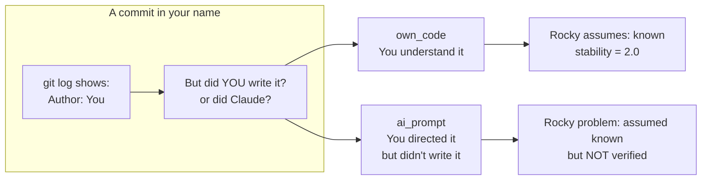
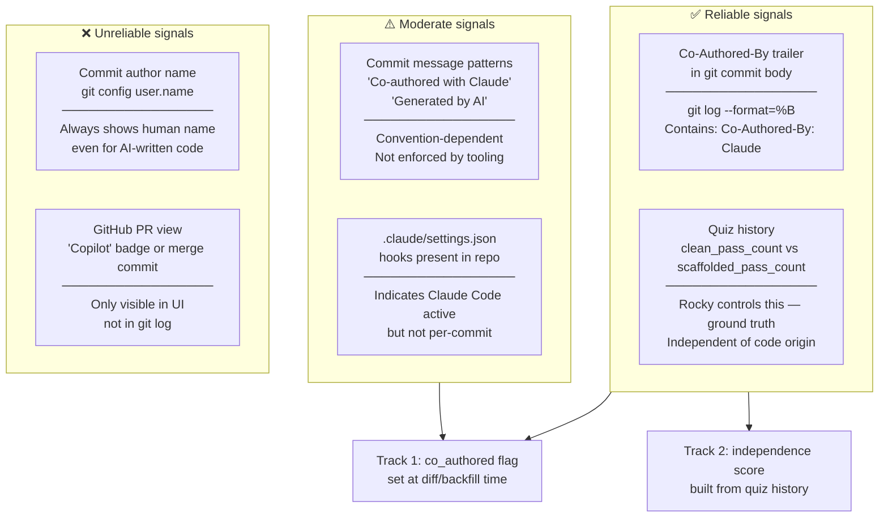
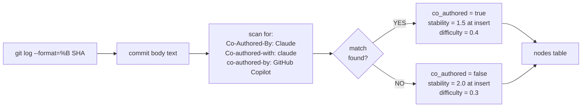
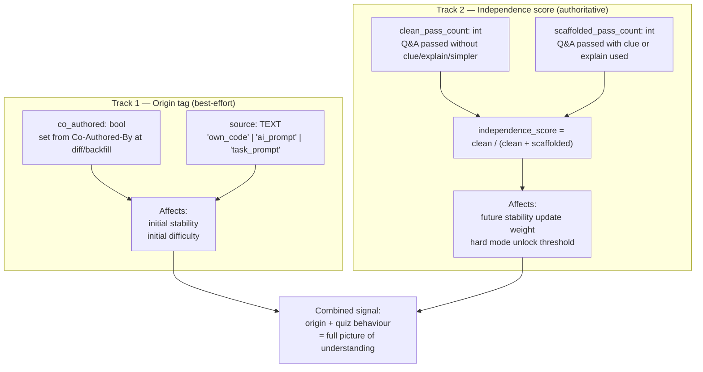
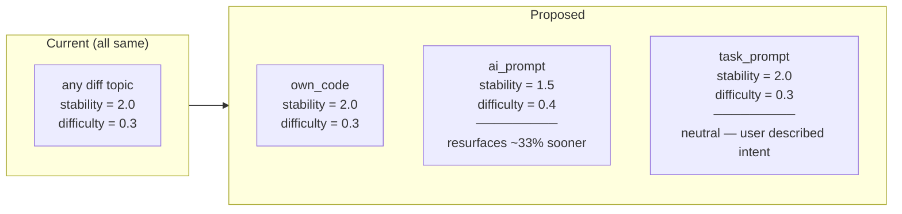
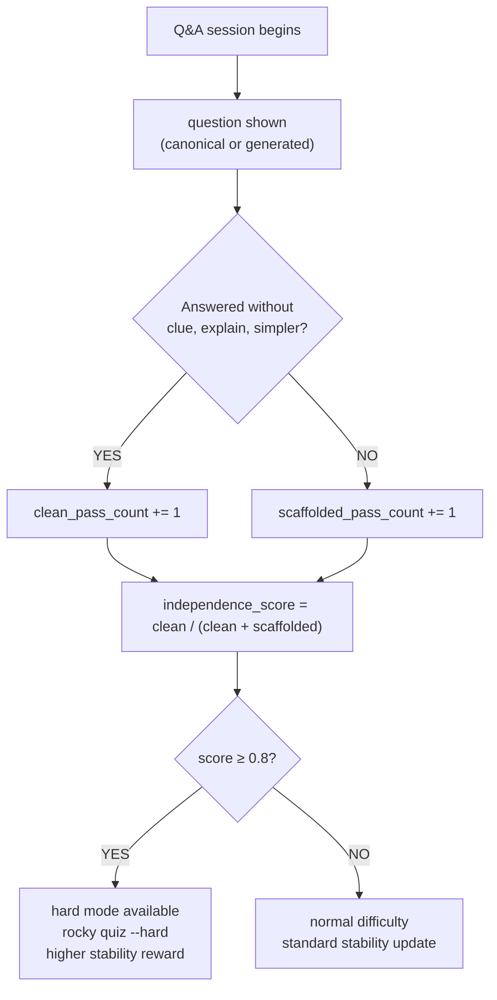

# 06 · Source Classification — AI-Authored vs Own Code

**Source files:** `src/db.rs` · `src/main.rs` — `run_diff()`, `run_backfill()`

---

## The core problem



---

## Available signals — reliability ranking



---

## Co-Authored-By detection — how it works



---

## Proposed two-track approach



---

## Source field values

| Value | When assigned | Example |
|---|---|---|
| `own_code` | `rocky diff` — no Co-Authored-By found | You wrote the function yourself |
| `ai_prompt` | `rocky diff` or `backfill` — Co-Authored-By found | Claude wrote it, you reviewed/merged |
| `task_prompt` | `rocky "task desc"` — user described intent | You described what to build, not what exists |

---

## Effect on initial stability



---

## Independence score — quiz feedback loop



---

## Planned DB columns

```sql
-- Track 1: origin
ALTER TABLE nodes ADD COLUMN co_authored INTEGER NOT NULL DEFAULT 0;
ALTER TABLE nodes ADD COLUMN source TEXT NOT NULL DEFAULT 'own_code';

-- Track 2: independence
ALTER TABLE reviews ADD COLUMN clue_used INTEGER NOT NULL DEFAULT 0;
ALTER TABLE reviews ADD COLUMN explain_used INTEGER NOT NULL DEFAULT 0;
ALTER TABLE reviews ADD COLUMN simpler_used INTEGER NOT NULL DEFAULT 0;
ALTER TABLE reviews ADD COLUMN followup_count INTEGER NOT NULL DEFAULT 0;
```

---

## 📝 Annotation space

> Add your notes here. Questions to consider:
>
> - Is `stability = 1.5` for `co_authored` aggressive enough? Too aggressive?
> - Should `task_prompt` topics also get lower stability since the user hasn't verified they can build it?
> - Should `independence_score` decay over time, or only update with new quiz data?
> - Should `co_authored` affect stability updates too, not just initial stability?
> - Is there a case for `rocky diff --mark-own` to manually override AI detection on a commit?
> - What happens when a topic starts as `ai_prompt` but the user later demonstrates mastery?
>   Should the `source` tag be immutable, or should it flip to `own_code` after sufficient clean passes?
