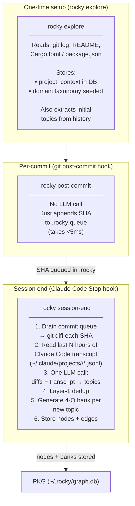
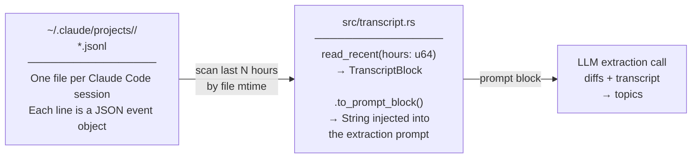

# 07 · Rich-Context Pipeline — explore → post-commit → session-end

**Source files:** `src/main.rs` — `run_explore()`, `run_post_commit()`, `run_session_end()` · `src/transcript.rs`

The pipeline solves the "vague question" problem: when Rocky extracts topics from a
single diff it only sees a few lines of code. By batching commits with the Claude Code
session transcript, Rocky gets full conversational context — what the user was trying
to build, why they made each decision, and what they discussed with the AI.

---

## Stage overview



---

## The commit queue

Location: `.rocky` (per-project SQLite, same file as prompt log).

```sql
CREATE TABLE queued_commits (
    sha TEXT PRIMARY KEY,
    queued_at TEXT NOT NULL
);
```

`rocky post-commit` appends the current HEAD SHA.
`rocky session-end` reads all rows, processes them, and deletes them.

If session-end is not run (e.g. no Claude Code session today), SHAs accumulate and
are all processed on the next session-end call. There is no expiry — commits stay
queued until drained.

---

## Transcript reading



`rocky session-end --hours 12` looks back 12 hours (default 6).
Only message-type events (`human` / `assistant`) are included.
Tool results are stripped to keep the prompt compact.

---

## Extraction prompt structure

```
=== Project Context ===
<stored from rocky explore>

=== Existing topics (do not re-extract) ===
rust lifetime, borrow checker, FSRS algorithm, ...

=== Git diffs from this session ===
--- commit abc1234: "feat: add retry logic" ---
<diff output>

=== Claude Code session transcript ===
[human] how should I handle the retry backoff here?
[assistant] Exponential backoff with jitter is standard...
...

Extract topics the developer learned or worked with. Return JSON array.
```

The existing-topics list is the layer-1 dedup guard — the LLM is instructed to skip
any topic that is semantically the same as one already in the list.

---

## Hook installation

```bash
# Install both hooks at once:
rocky hook install --mode queue    # post-commit → queue mode
rocky hook install --stop          # Claude Code Stop hook → session-end

# Verify:
rocky hook status
```

After install, `.git/hooks/post-commit` contains `rocky post-commit` and
`~/.claude/settings.json` has the `Stop` matcher entry.

---

## Manual commands

| Command | What it does |
|---|---|
| `rocky explore` | Build/refresh project context, seed initial topics |
| `rocky explore --show` | Print stored project context |
| `rocky explore --force` | Re-run even if context already exists |
| `rocky post-commit` | Queue HEAD SHA (called by git hook) |
| `rocky session-end` | Drain queue + transcript → enrich PKG |
| `rocky session-end --hours 12` | Look back 12h for transcript activity |
| `rocky session-end --quiet` | Suppress output (used by Stop hook) |
| `rocky backfill` | Retroactive history import (bypasses queue) |
| `rocky backfill --fill-question-bank` | Generate banks for nodes missing them |

---

## 📝 Annotation space

> Add your notes here. Questions to consider:
>
> - Should session-end set a lock so it doesn't run twice if the Stop hook fires twice?
> - Should there be a `rocky session-end --dry-run` that prints what would be extracted?
> - How should we handle very long transcripts that exceed LLM context window?
>   (Current approach: truncate to most recent N tokens)
> - Should the project context be versioned, so Rocky can show "context last updated 3 days ago"?
> - Should the commit queue have an expiry (e.g. drop SHAs older than 30 days)?
