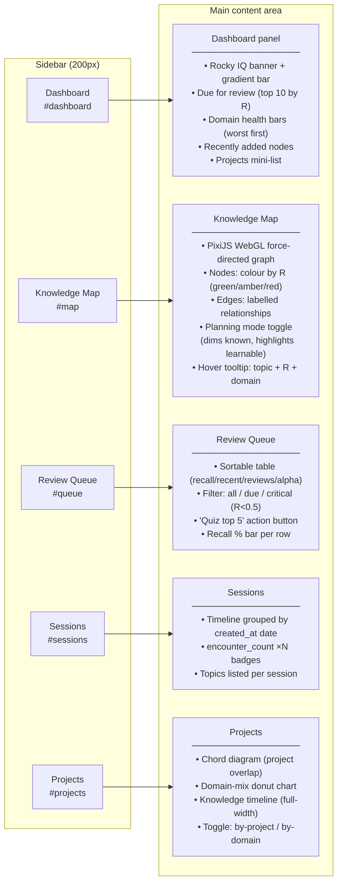

# 08 · Rocky IQ & Web UI — Dashboard, Map, Queue, Sessions, Projects

**Source files:** `src/server.rs` · `src/app.html`

---

## Rocky IQ

Rocky IQ is a 0–100 score that answers: **"How much of what I recently learned am I still retaining?"**

It is the inverse of atrophy, weighted by recency.

```
For each node created in the last 60 days:
  w     = max(0, 1 - days_since_created / 60)   # recent nodes weigh more
  R     = retrievability(stability, last_reviewed)
  decay = max(0, 0.7 - R) / 0.7                 # gap below the 0.7 threshold

atrophy = Σ(w × decay) / Σ(w)

Rocky IQ = round((1 - atrophy) × 100)
```

**Thresholds:**

| Rocky IQ | Colour | Interpretation |
|---|---|---|
| ≥ 80 | Green | Strong retention across recent topics |
| 70–79 | Yellow | Some decay, a few topics need review |
| < 70 | Red | Significant atrophy — schedule review sessions |

A fresh PKG with no topics returns IQ = 100 (no decay possible).

---

## 5-tab sidebar layout

Rocky's web view (`rocky view`) uses a fixed 200 px left sidebar with URL-fragment routing.

```
#dashboard   → Dashboard
#map         → Knowledge Map
#queue       → Review Queue
#sessions    → Sessions
#projects    → Projects
```



---

## /api/data response shape

`GET /api/data` is the primary data feed for the web UI.

```json
{
  "nodes": [...],
  "edges": [...],
  "atrophyScore": 0.12,
  "domainHealth": [
    { "domain": "Databases", "count": 4, "avg_recall": 0.61, "known": 1, "fading": 2, "gap": 1 },
    ...
  ],
  "dueForReview": [
    { "id": "abc123", "topic": "FSRS algorithm", "domain": "Algorithms", "retrievability": 0.41, "last_reviewed": "2026-03-15" },
    ...
  ],
  "recentlyAdded": [
    { "id": "def456", "topic": "exponential backoff", "domain": "Distributed Systems", "created_at": "2026-04-20", "kind": "pattern" },
    ...
  ]
}
```

`Rocky IQ = round((1 - atrophyScore) × 100)`

---

## /api/sessions response shape

`GET /api/sessions` returns topics grouped by `created_at` date.

```json
{
  "sessions": [
    {
      "date": "2026-04-20",
      "topics": [
        { "id": "...", "topic": "...", "domain": "...", "kind": "...", "encounter_count": 2 }
      ]
    }
  ]
}
```

---

## Knowledge Map rendering

The map uses **PixiJS** (WebGL renderer) with a D3 force simulation.

Key implementation details:
- Canvas dimensions read after `requestAnimationFrame × 2` to ensure layout has settled
- `app.renderer.render(app.stage)` called synchronously after 200 manual sim ticks
  to force the first frame (prevents blank canvas until mouse move)
- Nodes: circles coloured `#10b981` (known), `#f59e0b` (fading), `#ef4444` (gap)
- Planning mode: known nodes dimmed to 30% opacity, unlearned-adjacent nodes highlighted

---

## 📝 Annotation space

> Add your notes here. Questions to consider:
>
> - Should Rocky IQ be per-project or global across all projects?
> - Should the Dashboard show a "streak" (consecutive days with review activity)?
> - Should the Review Queue support bulk-quiz (multi-topic session from queue selection)?
> - Should the Knowledge Map have a search/filter bar to highlight nodes by topic name?
> - Should the Projects tab show a per-project Rocky IQ breakdown?
> - Is URL-fragment routing enough, or should we move to a proper SPA router?
