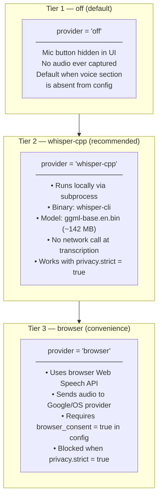
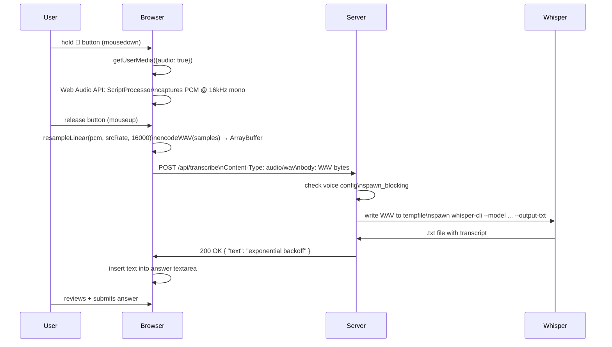
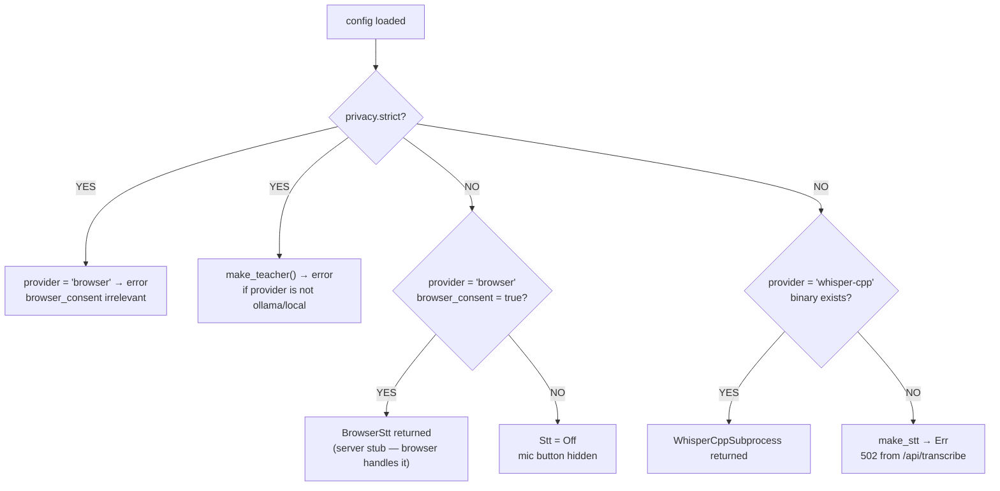

<style>
body {
    font-family: 'Roboto', sans-serif;
}
code, pre {
    font-family: 'Fira Code', 'Courier New', monospace;
}
</style>

# 09 · Voice Architecture — Push-to-Talk Web UI + whisper.cpp Backend

**Source files:** `src/voice.rs` · `src/server.rs` `/api/transcribe` · `src/app.html` mic button · `src/config.rs` VoiceConfig · `scripts/install-whisper.sh`

---

## Why local STT?

Rocky is privacy-first — it sees your entire coding session (commits, prompts, answers).
Sending audio to a cloud API would leak that context. whisper.cpp runs entirely
on-device with no network requests at transcription time.

---

## Three provider tiers



---

## Push-to-talk flow (web UI)



---

## /api/transcribe — status codes

| Code | Meaning |
|---|---|
| 200 | Transcript returned in `{ "text": "..." }` |
| 400 | `provider = "browser"` — transcription is client-side, server never called |
| 413 | Payload > 10 MB |
| 422 | WAV too short / empty audio |
| 502 | `whisper-cli` binary not found or failed to execute |
| 503 | Voice is off (`provider = "off"`) |

---

## Config

```toml
# ~/.config/rocky/config.toml

[privacy]
strict = false   # set true to block all cloud LLMs and browser STT

[voice]
provider        = "whisper-cpp"
model           = "~/.rocky/models/ggml-base.en.bin"
binary          = "~/.local/bin/whisper-cli"
silence_ms      = 700
tts             = "browser"         # planned: TTS provider (not yet used)
browser_consent = false             # must be true to use provider = "browser"
```

---

## Privacy enforcement



---

## WhisperCppSubprocess::transcribe

```rust
// src/voice.rs
impl Stt for WhisperCppSubprocess {
    fn transcribe(&self, wav_bytes: &[u8]) -> Result<String> {
        // 1. Write WAV to NamedTempFile (auto-deleted on drop)
        let mut f = NamedTempFile::new()?;
        f.write_all(wav_bytes)?;

        // 2. Spawn whisper-cli
        //    whisper-cli -m <model> -f <wav> --output-txt --no-prints
        let out_path = f.path().with_extension("txt");
        let status = Command::new(&self.binary)
            .args(["-m", &self.model, "-f", f.path(), "--output-txt", "--no-prints"])
            .status()?;

        // 3. Read .txt output file
        let text = fs::read_to_string(&out_path)?;
        Ok(text.trim().to_string())
    }
}
```

---

## Setup

```bash
# Install whisper-cli + download model + write config block
./scripts/install-whisper.sh

# On macOS, Homebrew is preferred:
./scripts/install-whisper.sh   # prompts to use brew

# Non-interactive (CI):
./scripts/install-whisper.sh --yes --quiet
```

The script is idempotent — re-running upgrades to the latest model without
duplicating config entries.

---

## Planned: CLI hands-free mode

`rocky quiz --voice` is deferred (not in v0.2). It would require:
- `cpal` for mic capture at the Rust layer
- `webrtc-vad` for silence detection
- System TTS for reading questions aloud

Complexity and C-binding dependency chain pushed this to a future release.

---

## 📝 Annotation space

> Add your notes here. Questions to consider:
>
> - Should there be a `rocky voice test` command to verify the setup end-to-end?
> - Should silence detection be configurable per-session (e.g. louder room = higher threshold)?
> - Should whisper model size be configurable? (tiny vs base vs small — tradeoff: speed vs accuracy)
> - Should browser TTS be wired up for reading questions aloud (the `tts = "browser"` config key)?
> - Should the mic button show a visual waveform while recording?
> - Is push-to-hold the right UX, or would push-to-toggle work better for long answers?
